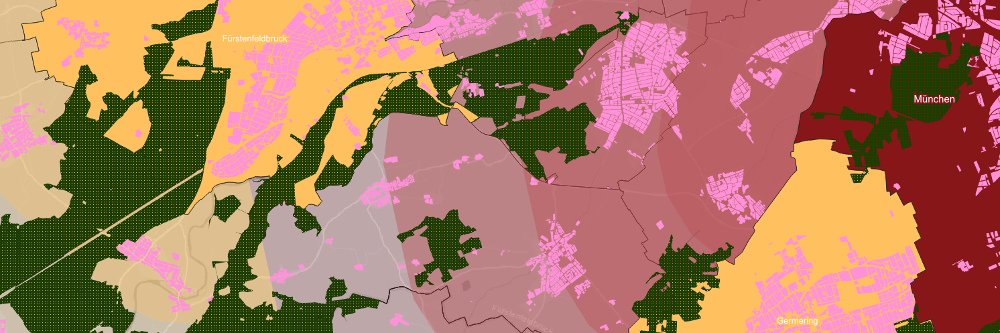

# Residential-Location-Analysis-in-Bavaria-using-QGIS

This project investigates potential residential locations in Bavaria based on spatial planning and landscape-related criteria. It represents a further development of my previous residential location analysis project in Baden-Württemberg and extends the analysis to the entire southern German region.

---
## Objective

Potential residential locations throughout Bavaria are filtered based on the following criteria:

Distance to a municipality classified as at least a Medium-order Centre according to the Bavarian State Development Programme (LEP Bayern).
- Medium-order Centre:   max. 4 km
- Higher-order Centre:   max. 6 km
- Regional Centre:       max. 8 km
- Metropolitan Centre:   max. 10 km

The classification of Central Places is based on the Bavarian State Development Programme (LEP). Medium-order Centres provide regional services beyond basic everyday needs, including further education facilities, specialised medical services, administrative functions, and employment opportunities.
- Distance to contiguous forest areas with a minimum size of 0.5 km², considered as potential recreational areas:   max. 1.5 km

---
## Methological Improvements

The previous Baden-Württemberg project revealed several challenges and inaccuracies. The following improvements were implemented to address these issues:
- Inaccurate urban areas caused by buffering building polygons instead of actual settlement structures
  - This analysis does not define suitability based on the physical extent of cities. Instead, it uses the official classification of Central Places from the Bavarian State Development Programme (LEP) to define minimum requirements.
  - Official municipality boundaries (ALKIS) are used as the basis for buffering.
  - However, the calculated distance refers to the municipality boundary rather than the actual built-up area, which is often considerably smaller.
- To improve map readability, scale-dependent rendering functions were applied to selected elements.
- To better visualise the influence areas of municipalities, a multi-stage transparent buffer system was created depending on the classification of each municipality. Higher-order centres are prioritised over lower-order centres to avoid overlapping areas with mixed colours.
- Residential areas were added as the top layer of the analysis. This significantly reduces the potentially suitable area, as areas such as agricultural land are excluded from the residential suitability assessment.

---
## Insights

Due to the use of official Central Place classifications, the municipality dataset required an additional attribute containing the corresponding centrality category. Since this information could not be directly derived from the existing geodata, a separate Excel table was created assigning each municipality its respective Central Place category. This table was then imported into QGIS as a CSV file and joined with the existing attribute table.

Another important aspect was the creation of a structured data environment. All relevant layers, including their associated styles, were finally stored in a single GeoPackage. This makes the project easier to manage and allows it to be shared or reopened without numerous separate source files.

---
## Data Sources

+ Bavarian Surveying Administration – Open Data (Land Use):
https://geodaten.bayern.de/opengeodata/OpenDataDetail.html?pn=ln
+ Bavarian Surveying Administration – Open Data (ALKIS Administrative Areas):
https://geodaten.bayern.de/opengeodata/OpenDataDetail.html?pn=verwaltung
+ Bavarian State Development Programme (LEP Bayern):
https://www.gesetze-bayern.de/Content/Document/BayLEP/true?view=Print

---
## Results

